# Projektdokumentation – FocusFighter

## Inhaltsverzeichnis

1. [Ausgangslage](#1-ausgangslage)
2. [Lösungsidee](#2-lösungsidee)
3. [Vorgehen & Artefakte](#3-vorgehen--artefakte)
    1. [Understand & Define](#31-understand--define)
    2. [Sketch](#32-sketch)
    3. [Decide](#33-decide)
    4. [Prototype](#34-prototype)
    5. [Validate](#35-validate)
4. [Erweiterungen](#4-erweiterungen)
5. [Projektorganisation](#5-projektorganisation)
6. [KI-Deklaration](#6-ki-deklaration)
7. [Anhang](#7-anhang)

---

## 1. Ausgangslage

- **Problem:** Kampfsport-Trainer (Boxen, MMA, Kickboxen) haben im Trainingsalltag keine einfache, digitale Lösung, um Trainingsintervalle präzise zu steuern und Beobachtungen zu Athleten festzuhalten. Physische Stoppuhren bieten keine Dokumentationsmöglichkeit; allgemeine Timer-Apps kennen keine Kampfsport-spezifischen Modi wie Sparring-Runden oder HIIT-Intervalle.
- **Ziele:**
  - Digitaler Trainingstimer mit konfigurierbaren Runden, Arbeits- und Pausenzeiten
  - Integriertes Trainingsjournal zur Dokumentation von Einheiten und Athleten-Notizen
  - Personalisierte Benutzerkonten, damit jeder Trainer seine eigene Trainingshistorie verwaltet
  - Dashboard mit Wochenübersicht und persönlichem Wochenziel
- **Primäre Zielgruppe:** Kampfsport-Trainer in Vereinen und Studios (Boxen, MMA, Kickboxen), die regelmässig Gruppentrainings leiten und den Fortschritt ihrer Athleten dokumentieren möchten.
- **Weitere Stakeholder:** Athleten, die von strukturierten Trainingseinheiten profitieren; Vereinsleitungen, die Trainingsqualität sicherstellen möchten.

---

## 2. Lösungsidee

- **Kernfunktionalität:**
  1. **Authentifizierung:** Trainer erstellt einen persönlichen Account (E-Mail + Passwort). Alle Daten sind ausschliesslich dem eigenen Account zugeordnet.
  2. **Workout auswählen:** Auswahl aus 4 vorkonfigurierten Modi (Sparring, HIIT, Schattenboxen, Sandsack), jeweils mit sinnvollen Standardwerten.
  3. **Setup:** Runden, Arbeitszeit und Pausenzeit individuell anpassen; beim Sparring-Modus optional Kämpfer-Namen erfassen.
  4. **Timer:** Vollbild-Timer mit Prep-Phase (10 s), Arbeits- und Pausenphasen, Rundeninfo und Skip-Buttons. Tap-to-Pause auf dem gesamten Bildschirm.
  5. **Session speichern:** Nach dem Training werden Konfiguration und optionale Trainer-Notizen dauerhaft gespeichert.
  6. **Dashboard & Historie:** Wochenstatistik, Zielfortschritt und die letzten Einheiten auf einen Blick; vollständiges Trainingsjournal mit Datumsgruppierung.
- **Annahmen:** Trainer verfügen über ein Gerät mit Browser (Desktop oder Tablet) während des Trainings. Internetverbindung für Datenbankzugriff ist gegeben.
- **Abgrenzung:** Keine Athleten-eigenen Accounts; keine Video- oder Bildanalyse; keine Echtzeit-Synchronisation mehrerer Trainer.

---

## 3. Vorgehen & Artefakte

### 3.1 Understand & Define

- **Zielgruppenverständnis:** Interviews und Beobachtungen im Trainingsalltag zeigten, dass Trainer während einer Einheit wenig Zeit für Bedienung haben – die App muss mit minimalem Interaktionsaufwand bedienbar sein (grosse Tap-Flächen, Auto-Start des Timers). Notizen werden oft erst nach einer Übung erfasst, nicht live.

- **Proto-Persona:**

  | | |
  |---|---|
  | **Name** | Marco, 34 |
  | **Rolle** | Vereinstrainer (Boxen), leitet 3–4 Abendtrainings pro Woche |
  | **Kontext** | Trägt oft Handschuhe oder hält Pratzen – bedient Geräte eingeschränkt |
  | **Bedürfnisse** | Timer ohne viele Klicks starten; Notizen nach der Einheit festhalten |
  | **Frustrationen** | Muss Stoppuhr und Notizblock gleichzeitig handhaben; vergisst Rundenzeiten |
  | **Ziel** | Eine App, die den Timer übernimmt, damit er sich auf die Athleten konzentrieren kann |

- **Wesentliche Erkenntnisse:**
  - Timer muss vollbildschirmfüllend und einhandbedienbar sein
  - Trainer kennen ihre Standard-Modi (Sparring 3 min/1 min etc.) und wollen Abweichungen schnell einstellen können
  - Historisierung und Notizen sind für die Trainingsplanung der nächsten Woche wichtig
  - Personalisierung (eigener Account) ist Voraussetzung für mehrere Trainer im gleichen Verein

### 3.2 Sketch

**Skizzen:** [docs/sketches.pdf](docs/sketches.pdf)

Es wurden vier Lösungsansätze skizziert und bewertet:

| Variante | Kernidee | Bewertung |
|---|---|---|
| **Quick Start** | Workout-Tabs (Fitness / Sparring / Sandsack) + Runden-Slider (3, 6, 9, 12) direkt auf dem Startscreen | ✅ Spart Zeit, eigene Presets wären cool — zu wenig Konfiguration |
| **Minimalistisch** | Nur grosser Ring-Timer (04:30) + Start-Button, keine Navigation | ✅ Erleichtert Fokus, weniger ablenkend — fehlende Dokumentation/History |
| **Session-Steuerung** | Timer mit Job-Access-Liste links + Gestensteuerung (Faust-Geste zum Pausieren) | ✅ Gute Idee, behebt das Handschuh-Problem — Geste schwer erkennbar |
| **Dashboard + Speech UI** | Vorherige Sessions als Liste + Sprachsteuerung über Mikrofon | ✅ Dokumentation und Sprachbefehle ideal für Handschuh-Nutzung |

**Entscheidungsprozess (Seite 2 der Skizzen):**
Die finale Lösung kombiniert Quick Start und Gestensteuerung: Workout-Liste → 5-Sekunden-Countdown → Vollbild-Timer mit grünem Hintergrund (signalisiert Action), überall antippbar zum Pausieren. Erhöht die Usability mit Handschuhen, spart Zeit mit dem Quick-Start-Menü.

### 3.3 Decide

- **Gewählte Variante & Begründung:** Variante B – Mehrseitige Navigation. Entscheidend war die Trennung zwischen dem Vollbild-Timer (keine Ablenkung während des Trainings) und dem Dashboard/History-Bereich (strukturierte Übersicht). Eine Sidebar-Navigation auf Desktop und eine Bottom-Bar auf Mobile entsprechen bekannten Nutzungsmustern und reduzieren die kognitive Last.

- **End-to-End-Ablauf (User Journey):**

  | Schritt | Seite | Nutzeraktion |
  |---|---|---|
  | 1 | `/login` | Registrierung oder Login mit E-Mail + Passwort |
  | 2 | `/dashboard` | Wochenübersicht lesen, „Workout starten" klicken |
  | 3 | `/workouts` | Trainingstyp auswählen (Sparring, HIIT, …) |
  | 4 | `/setup/[type]` | Runden, Arbeitszeit, Pausenzeit anpassen, starten |
  | 5 | `/workout` | Timer läuft im Vollbild; Pause/Resume per Tap |
  | 6 | Abschluss-Dialog | Notizen eingeben, Session speichern |
  | 7 | `/dashboard` oder `/history` | Vergangene Einheiten einsehen |

- **Mockup:** [Figma – FocusFighters](https://www.figma.com/design/9Ur54AqWxJTMP7WU7QHRTO/FocusFighters?node-id=0-1&t=PDJLW4a8wrmmT660-1)

### 3.4 Prototype

#### 3.4.1 Entwurf (Design)

- **Informationsarchitektur:**

  | Route | Funktion |
  |---|---|
  | `/login` | Authentifizierung (Login & Registrierung) |
  | `/dashboard` | Wochenübersicht, letzte Einheiten, Schnellstart |
  | `/workouts` | Auswahl des Workout-Typs und eigener Trainings |
  | `/setup/[type]` | Konfiguration von Runden, Zeiten, Kämpfer-Namen |
  | `/workout` | Vollbild-Timer |
  | `/history` | Vollständiges Trainingsjournal |
  | `/settings` | Theme, Sprache, Wochenziel, Sprachsteuerung |

- **User Interface Design:**
  - **Dark-First-Design** mit tiefem Navy-Blau (`#050810`) als Hintergrund und Grün (`#2ecc71`) als Akzentfarbe – typisch für Kampfsport-Apps und reduziert Augenermüdung bei schlechter Beleuchtung in Sporthallen
  - **Timer-Screen:** Vollbild, farbkodiert (Grün = Arbeit, Orange = Pause, Rot = Pausiert) mit radialem Hintergrund-Glow. Kreisförmiger Fortschrittsring, grosse Zeitanzeige. Tap-to-Pause auf dem gesamten Bildschirm.
  - **Dashboard:** Glasmorphismus-Karten für Statistiken, grüner Fortschrittsbalken für das Wochenziel
  - **Responsiv:** Sidebar-Navigation ab 769 px, floating Bottom-Bar auf Mobile
  - **Light-Mode:** Warmes Off-White (`#f0ede8`), alle Texte explizit auf Lesbarkeit geprüft

  | Screen | Beschreibung |
  |---|---|
  | 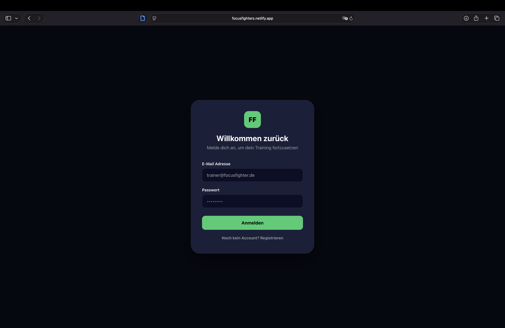 | **Login / Registrierung** — Toggle zwischen Login und Registrierung, E-Mail + Passwort |
  | 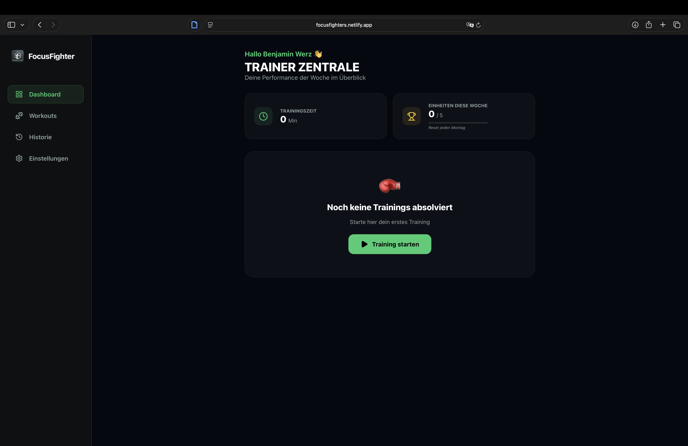 | **Dashboard** — Wochenstatistik, Trainingszeit, Wochenziel-Fortschritt, Empty-State mit CTA |
  | 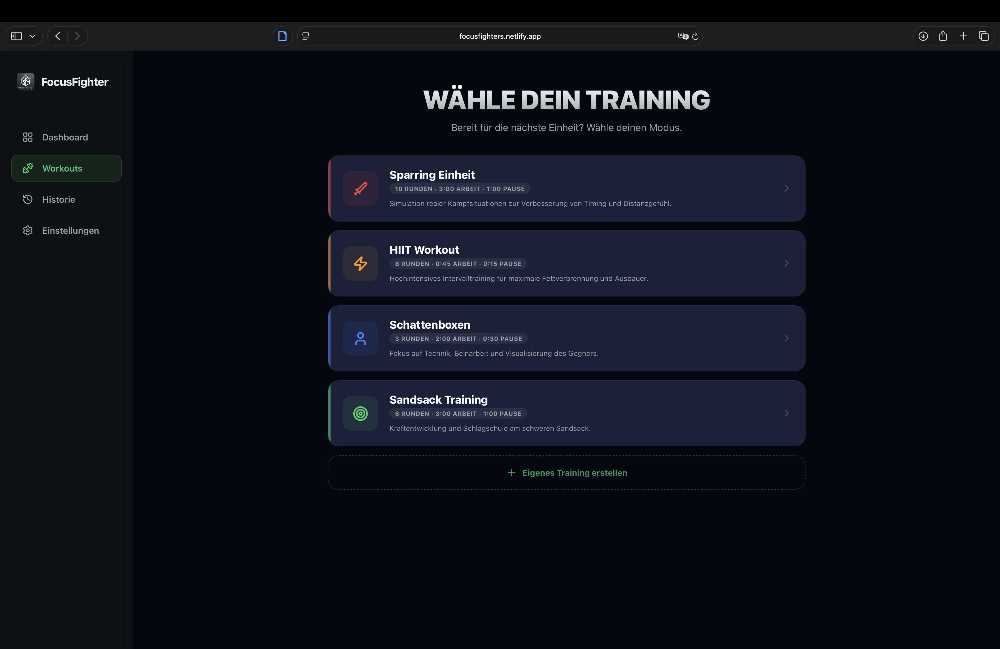 | **Workout-Auswahl** — 4 Preset-Modi + Button zum Erstellen eigener Trainings |
  | 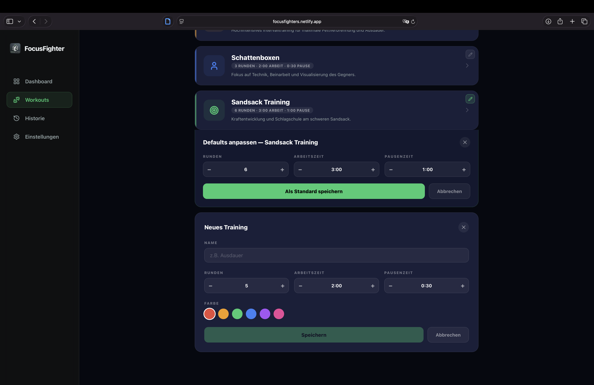 | **Preset-Personalisierung** — Stift-Icon öffnet Inline-Editor für Standardwerte jedes Presets |
  | 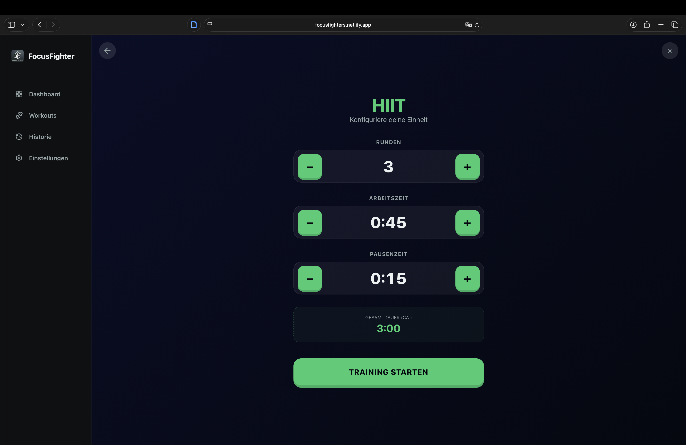 | **Setup** — Konfiguration von Runden, Arbeits- und Pausenzeit mit Live-Gesamtdauer |
  | 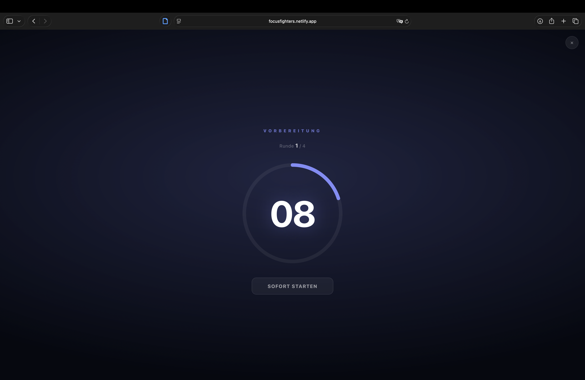 | **Timer: Vorbereitung** — 10-Sekunden-Countdown startet automatisch, Sofort-Starten-Button |
  | 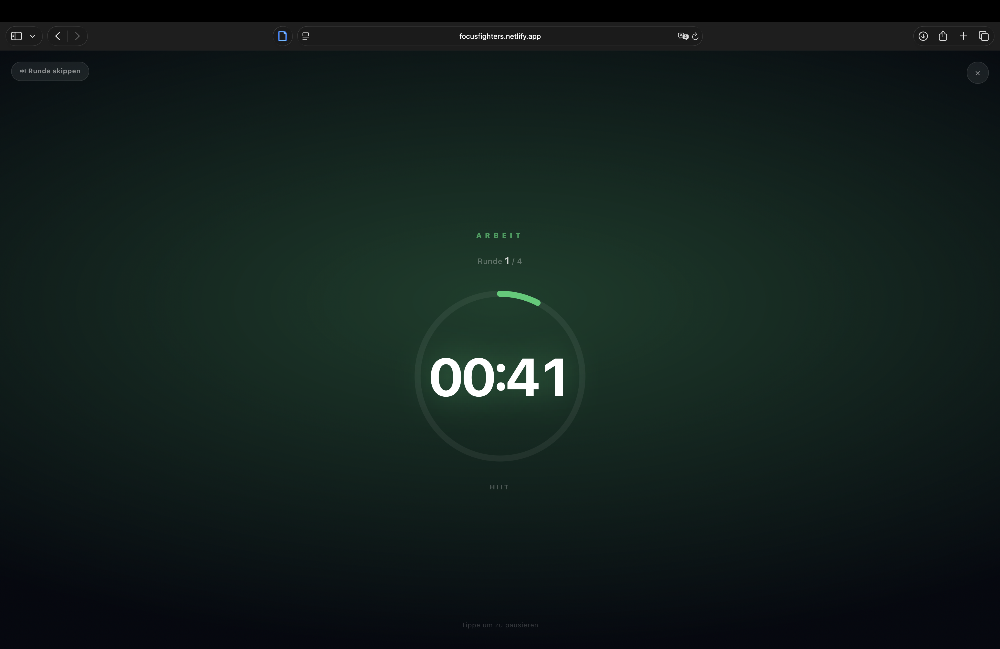 | **Timer: Arbeit** — Grüner Hintergrund-Glow, Ring-Fortschritt, Skip-Button oben links |
  | 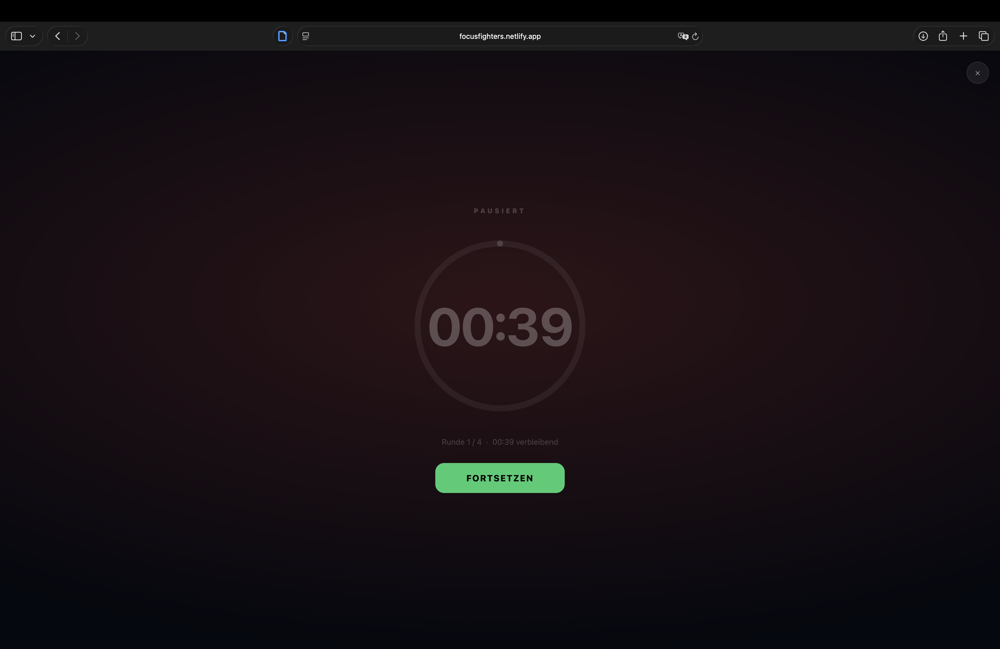 | **Timer: Pausiert** — Roter Glow, gedimmter Ring, Fortsetzen-Button |
  | 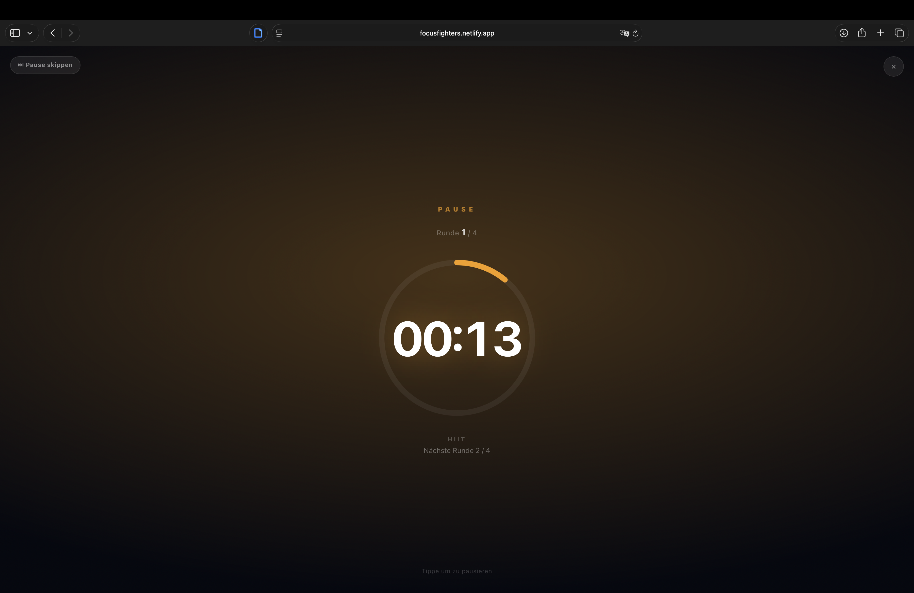 | **Timer: Pause** — Amber-Glow, nächste Runde angezeigt, Pause-skippen-Button |
  | 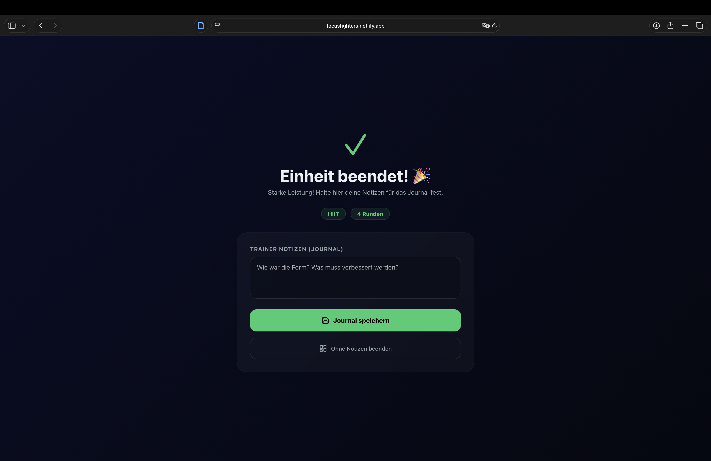 | **Trainingsabschluss** — Journal-Notizen erfassen und speichern |
  | 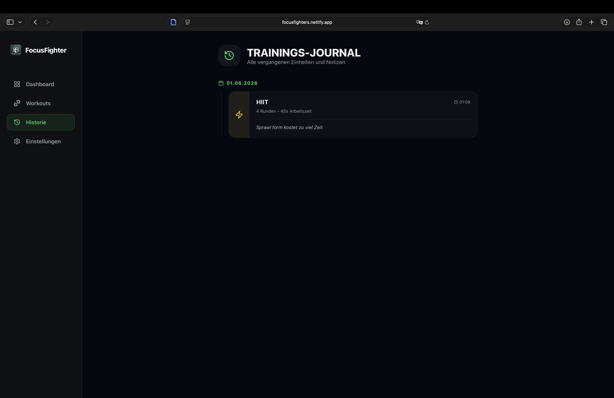 | **Trainings-Journal** — Alle Sessions nach Datum gruppiert mit Notizen und Lösch-Button |
  | 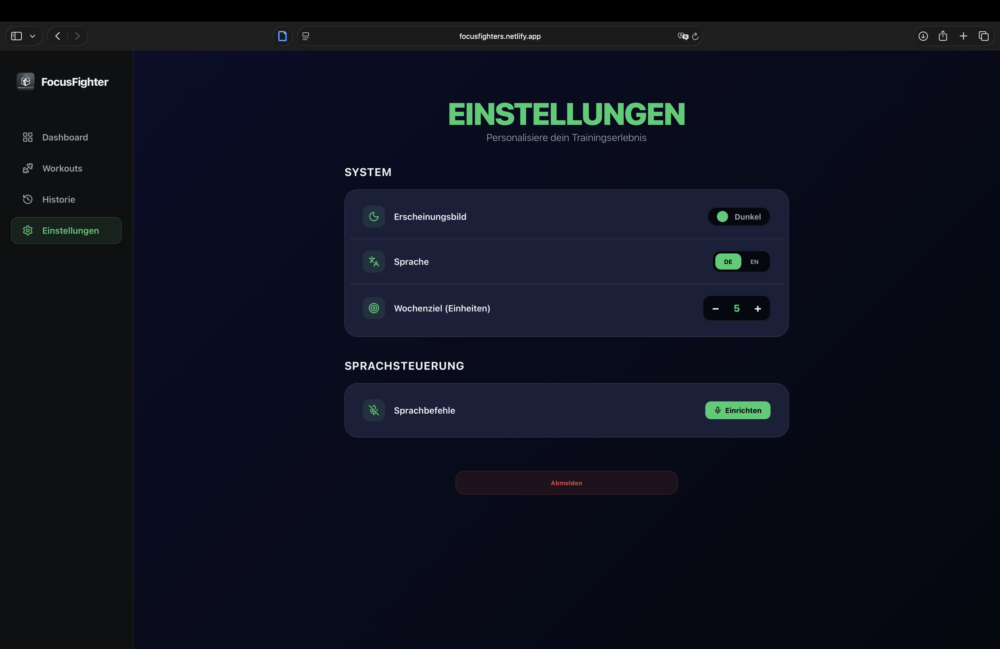 | **Einstellungen** — Theme, Sprache, Wochenziel, Sprachsteuerung einrichten |

- **Designentscheidungen:**
  - Farbkodierung der Timer-Phasen für sofortige visuelle Rückmeldung ohne Text lesen zu müssen
  - Auto-Start des 10-Sekunden-Countdowns beim Öffnen der Timer-Seite – eine Interaktion weniger beim Trainingsstart
  - Skip-Buttons für Runde und Pause oben links, klein und nicht im Hauptfokus, aber erreichbar
  - Login-Seite ohne Navbar, da sie kein Teil der App-Navigation ist

#### 3.4.2 Umsetzung (Technik)

- **Technologie-Stack:**
  - **Frontend:** SvelteKit 2 (Svelte 5 Runes), Vite 8
  - **UI-Bibliothek:** lucide-svelte (Icons)
  - **Backend:** SvelteKit Server-Side (Form Actions, Load Functions)
  - **Datenbank:** MongoDB Atlas (Cloud)
  - **Auth:** bcryptjs (Passwort-Hashing), eigene Session-Verwaltung mit Cookies
  - **Audio:** Web Audio API (kein externes Package – synthetisierte Beep-Töne direkt im Browser)
  - **Deployment:** Netlify (Adapter: `@sveltejs/adapter-netlify`)

- **Tooling:** VS Code mit Svelte-Extension, Claude Code (KI-Assistent, Claude Sonnet 4.6), MongoDB Compass (DB-Verwaltung lokal)

- **Struktur & Komponenten:**

  ```
  src/
  ├── lib/
  │   ├── components/
  │   │   ├── Navbar.svelte      # Sidebar (Desktop) + Bottom-Bar (Mobile)
  │   │   └── Timer.svelte       # Vollbild-Timer-Komponente mit Audio
  │   ├── server/
  │   │   └── db.js              # MongoDB-Verbindung & Collection-Helpers
  │   └── settingsStore.js       # Client-seitiger Store (Theme, Sprache, Wochenziel, Preset-Defaults)
  └── routes/
      ├── +layout.svelte         # App-Shell, globale CSS-Variablen, Theme-System
      ├── login/                 # Authentifizierung (Login + Registrierung)
      ├── dashboard/             # Wochenstatistik, letzte Sessions
      ├── workouts/              # Workout-Typ-Auswahl + Preset-Personalisierung
      ├── setup/[type]/          # Trainings-Konfiguration
      ├── workout/               # Timer-Seite (Vollbild)
      ├── history/               # Trainingsjournal mit Lösch-Funktion
      └── settings/              # Einstellungen
  ```

- **Daten & Schnittstellen:**
  - **MongoDB-Datenbank:** `focus-fighters` mit drei Collections:
    - `trainers` – Benutzerdaten (E-Mail, gehashtes Passwort, Name)
    - `trainings` – Trainingseinheiten mit `trainerId`-Feld (Datentrennung pro User)
    - `sessions` – Login-Sessions (Cookie-basiert, 7 Tage gültig)
  - **Datenisolation:** Jede Datenbankabfrage filtert mit `{ trainerId: locals.user._id }` – kein Trainer sieht Daten eines anderen
  - **Client-State:** Theme, Sprache, Wochenziel und Preset-Defaults werden via `localStorage` persistiert (kein Server-Round-Trip nötig)
  - **Workout-Übergabe:** Konfiguration wird via `sessionStorage` zwischen Setup- und Timer-Route übergeben

- **Deployment:** [https://focusfighters.netlify.app](https://focusfighters.netlify.app)

- **Besondere Entscheidungen:**
  - Session-Management selbst implementiert statt OAuth-Bibliothek – bewusste Vereinfachung für den Projektumfang
  - CSS-Theme-System vollständig über CSS Custom Properties (`--var`) und globale Overrides im Layout – ermöglicht Theme-Wechsel ohne JavaScript-Neurenderings
  - `settingsStore` setzt die `light-theme`-Klasse auf `<html>` statt nur auf eine App-Container-Div, damit `body`-Hintergrund und Scrollbereiche ausserhalb des Containers korrekt umgefärbt werden
  - Web Audio API für Timer-Töne statt externe Sound-Dateien – keine zusätzlichen Assets, funktioniert offline

### 3.5 Validate

- **URL der getesteten Version:** [https://focusfighters.netlify.app](https://focusfighters.netlify.app)
- **Ziele der Prüfung:**
  - Ist der Timer ohne Erklärung sofort bedienbar?
  - Können Nutzer ein angepasstes Workout konfigurieren und starten?
  - Ist die Trainingshistorie auffindbar und verständlich?
- **Vorgehen:** Moderierter Usability-Test, on-site, szenariobasiert
- **Stichprobe:** 2 Testpersonen (Noel, Alen) – beide mit Erfahrung im Kampfsport-Training
- **Aufgaben/Szenarien** _(vollständiges Testskript: `UsabilityEvaluation.md`)_:
  1. **Standard-Training starten:** Sparring-Einheit mit Standard-Zeiten starten, Timer soll selbstständig laufen
  2. **Benutzerdefiniertes HIIT einrichten:** 10 Runden, 30 s Arbeit, 15 s Pause konfigurieren und starten
  3. **Journal führen & Historie prüfen:** Notizen nach dem Training erfassen, vergangene Einheiten in der Historie einsehen
- **Kennzahlen & Beobachtungen:**

  | Aufgabe | Noel | Alen | Beobachtung |
  |---|---|---|---|
  | Sparring starten | ✅ Erfolgreich | ✅ Erfolgreich | Beide sofort ohne Hilfe |
  | HIIT konfigurieren | ✅ Erfolgreich | ✅ Erfolgreich | Stepper-Bedienung intuitiv |
  | Notizen & Historie | ✅ Erfolgreich | ✅ Erfolgreich | Navigationsstruktur klar |

  - Noel vermisste die Möglichkeit, eine laufende Runde zu überspringen
  - Alen wünschte sich ein konfigurierbares Wochenziel (Sessions pro Woche)
  - Noel regte Musik-/Playlist-Integration an
  - Alen schlug zusätzliche Trainingstypen vor

- **Zusammenfassung der Resultate:** Alle drei Kernaufgaben wurden von beiden Testpersonen erfolgreich und ohne Hilfe abgeschlossen. Die App-Struktur und der Timer waren intuitiv verständlich. Der grösste Optimierungsbedarf lag in der Steuerung des laufenden Timers (fehlender Skip) und der Personalisierung der Zielwerte.

- **Abgeleitete Verbesserungen** (priorisiert):
  1. ✅ **Skip-Button für Runden und Pausen** – umgesetzt (vgl. Kap. 4.1)
  2. ✅ **Konfigurierbares Wochenziel** – umgesetzt (vgl. Kap. 4.2)
  3. ✅ **Eigene Trainings erstellen** – umgesetzt (vgl. Kap. 4.6)
  4. ⬜ **Musik-/Playlist-Integration** – offen

---

## 4. Erweiterungen

### 4.1 Skip-Button für Timer-Runden und Pausen

- **Beschreibung & Nutzen:** Während einer laufenden Arbeitsphase oder Pausenphase kann der Trainer die aktuelle Phase mit einem kleinen Button oben links überspringen und sofort in die nächste Phase wechseln. Dies ist im Trainingsalltag nötig, wenn eine Runde vorzeitig abgebrochen wird oder die Pause kürzer ausfallen soll.
- **Wo umgesetzt:**
  - **Frontend:** `src/lib/components/Timer.svelte` – Funktionen `skipRound()` und `skipRest()`, Button `.btn-skip-corner` oben links positioniert; `e.stopPropagation()` verhindert, dass der Klick gleichzeitig Pause auslöst
- **Referenz:** Screenshot Kap. 3.4.1 (Timer: Arbeit / Pause)
- **Aus Evaluation abgeleitet?:** Ja – Noel, Usability-Test

### 4.2 Konfigurierbares Wochenziel

- **Beschreibung & Nutzen:** In den Einstellungen kann jeder Trainer sein persönliches Wochenziel (Anzahl Einheiten pro Woche, 1–7) mit einem Stepper einstellen. Der Fortschrittsbalken und die `x / y`-Anzeige im Dashboard spiegeln den eingestellten Wert sofort wider.
- **Wo umgesetzt:**
  - **Frontend Settings:** `src/routes/settings/+page.svelte` – Stepper-Komponente mit +/−-Buttons
  - **Store:** `src/lib/settingsStore.js` – `weeklyGoal: 5` als Default, persistiert in `localStorage`
  - **Dashboard:** `src/routes/dashboard/+page.svelte` – liest `$settings.weeklyGoal`
- **Referenz:** Screenshot Kap. 3.4.1 (Einstellungen / Dashboard)
- **Aus Evaluation abgeleitet?:** Ja – Alen, Usability-Test

### 4.3 Benutzerauthentifizierung mit Account-Erstellung

- **Beschreibung & Nutzen:** Jeder Trainer erstellt einen eigenen Account (Name, E-Mail, Passwort mit Bestätigung). Trainingseinheiten sind über ein `trainerId`-Feld dem jeweiligen Account zugeordnet – kein Trainer sieht Daten eines anderen.
- **Wo umgesetzt:**
  - **Frontend:** `src/routes/login/+page.svelte` – Toggle zwischen Login- und Registrierungsmodus
  - **Backend:** `src/routes/login/+page.server.js` – Validierung, bcryptjs-Hashing (Stärke 12), Session-Erstellung
  - **Datenbank:** MongoDB `trainers`-Collection, `trainings`-Collection mit `trainerId`-Feld
- **Referenz:** Screenshot Kap. 3.4.1 (Login / Registrierung); Kap. 3.4.2 – Daten & Schnittstellen
- **Aus Evaluation abgeleitet?:** Nein – eigenständige Erweiterung für Produktionsreife

### 4.4 Dark / Light Mode

- **Beschreibung & Nutzen:** Die App unterstützt ein dunkles (Standard) und ein helles Theme. Das helle Theme verwendet ein warmes Off-White (`#f0ede8`) statt reinem Weiss, um Augenermüdung zu reduzieren. Alle Texte sind auf Lesbarkeit in beiden Modes geprüft.
- **Wo umgesetzt:**
  - **Store:** `src/lib/settingsStore.js` – `theme`-Wert, setzt `light-theme`-Klasse auf `<html>`
  - **Layout:** `src/routes/+layout.svelte` – CSS Custom Properties für beide Themes, globale Overrides für alle Seiten
- **Referenz:** Kap. 3.4.1 – UI Design
- **Aus Evaluation abgeleitet?:** Nein – eigenständige Erweiterung

### 4.5 Mehrsprachigkeit (Deutsch / Englisch)

- **Beschreibung & Nutzen:** Die gesamte App-Oberfläche ist in Deutsch und Englisch verfügbar. Die Sprache kann in den Einstellungen gewechselt werden; der Wechsel wirkt sofort auf alle Texte (Labels, Fehlermeldungen, Timer-Beschriftungen). Nutzer aus unterschiedlichen Sprachregionen können die App ohne Sprachbarriere verwenden.
- **Wo umgesetzt:**
  - **Alle Seiten und Timer-Komponente:** Jede Datei enthält ein `t = { de: {...}, en: {...} }`-Objekt; das aktive Übersetzungsobjekt wird via `$derived(t[$settings.language])` reaktiv gebunden
  - **Store:** `src/lib/settingsStore.js` – `language: 'de'` als Default, persistiert in `localStorage`
  - **Settings-Seite:** `src/routes/settings/+page.svelte` – Sprachumschalter
- **Referenz:** Screenshot Kap. 3.4.1 (Einstellungen)
- **Aus Evaluation abgeleitet?:** Nein – eigenständige Erweiterung

### 4.6 Eigene Trainings erstellen

- **Beschreibung & Nutzen:** Neben den vier vordefinierten Presets können Trainer vollständig eigene Trainingstypen anlegen (Name, Runden, Arbeitszeit, Pausenzeit, Farbe). Eigene Trainings erscheinen in der Workout-Liste, sind über dasselbe Setup-/Timer-System nutzbar und können gelöscht werden.
- **Wo umgesetzt:**
  - **Frontend:** `src/routes/workouts/+page.svelte` – Formular mit Stepper-Inputs und Farbauswahl; `saveCustomWorkout()` schreibt in `settings.customWorkouts`
  - **Store:** `src/lib/settingsStore.js` – `customWorkouts: []`, persistiert in `localStorage`
  - **Setup:** `src/routes/setup/[type]/+page.svelte` – liest `customWorkoutBase` aus `sessionStorage`
- **Referenz:** Screenshot Kap. 3.4.1 (Workout-Auswahl)
- **Aus Evaluation abgeleitet?:** Teilweise – Alen schlug zusätzliche Trainingstypen vor

### 4.7 Sprachsteuerung (Voice Control)

- **Beschreibung & Nutzen:** Optional kann ein Sprachbefehl zum Pausieren und Fortsetzen des Timers konfiguriert werden (z. B. „Stopp" / „Go"). Dies ist besonders relevant für Trainer, die während des Timers Handschuhe tragen und das Gerät nicht berühren können. Die Lösung nutzt die Web Speech Recognition API des Browsers.
- **Wo umgesetzt:**
  - **Timer-Komponente:** `src/lib/components/Timer.svelte` – `initVoiceControl()` / `destroyVoiceControl()`; visueller Mikrofon-Indikator oben rechts
  - **Settings-Seite:** `src/routes/settings/+page.svelte` – Toggle zum Aktivieren, Eingabefelder für Stop- und Go-Befehl
  - **Store:** `src/lib/settingsStore.js` – `voiceControl`, `voiceStopCommand`, `voiceGoCommand`
- **Referenz:** Screenshot Kap. 3.4.1 (Einstellungen / Timer: Arbeit mit Mic-Icon)
- **Aus Evaluation abgeleitet?:** Nein – eigenständige Erweiterung (inspiriert von Skizzen-Phase, vgl. Kap. 3.2)

### 4.8 Trainings-Sessions löschen

- **Beschreibung & Nutzen:** In der Trainingshistorie kann jede einzelne aufgezeichnete Session mit einem Lösch-Button (Trash-Icon) permanent entfernt werden. Dies erlaubt das Bereinigen von Testeinträgen oder fälschlich gespeicherten Sessions.
- **Wo umgesetzt:**
  - **Frontend:** `src/routes/history/+page.svelte` – Lösch-Button pro Session, `deleteSession()`-Funktion
  - **Backend:** Form Action in `src/routes/history/+page.server.js` – `DELETE`-Operation auf `trainings`-Collection, gefiltert nach `trainerId` (Sicherstellung, dass nur eigene Sessions gelöscht werden können)
- **Referenz:** Screenshot Kap. 3.4.1 (Trainings-Journal)
- **Aus Evaluation abgeleitet?:** Nein – eigenständige Erweiterung

### 4.9 Audio-Signale im Timer

- **Beschreibung & Nutzen:** Der Timer gibt akustisches Feedback, das besonders in lauten Trainingshallen hilfreich ist: Ein **einfacher Piepton** ertönt 10 Sekunden vor Ende jeder Arbeits- oder Pausenphase als Vorwarnung; ein **doppelter Piepton** signalisiert das Ende der Phase. Die Töne werden über die Web Audio API synthetisiert – keine externen Audio-Dateien nötig.
- **Wo umgesetzt:**
  - **Timer-Komponente:** `src/lib/components/Timer.svelte` – `playBeep(count)`-Funktion mit `AudioContext`; Lazy-Initialisierung des `AudioContext` beim ersten Tick (Browser-Autoplay-Policy konform)
- **Referenz:** Kap. 3.4.2 – Besondere Entscheidungen
- **Aus Evaluation abgeleitet?:** Nein – eigenständige Erweiterung

### 4.10 Personalisierbare Preset-Defaults

- **Beschreibung & Nutzen:** Jeder der vier vordefinierten Presets (Sparring, HIIT, Schattenboxen, Sandsack) kann über ein Stift-Icon in der Workout-Liste mit eigenen Standardwerten für Runden, Arbeitszeit und Pausenzeit versehen werden. Die Werte werden in `localStorage` gespeichert und beim nächsten Öffnen des Setup-Screens automatisch als Startwerte geladen. Ein Reset-Button stellt die Originalwerte wieder her. Angepasste Presets werden in der Karte durch eine grüne Beschriftung markiert.
- **Wo umgesetzt:**
  - **Frontend:** `src/routes/workouts/+page.svelte` – `openEdit()` / `saveEdit()` / `resetEdit()`; Inline-Edit-Panel mit Steppers
  - **Store:** `src/lib/settingsStore.js` – `presetDefaults: {}`, persistiert in `localStorage`
  - **Setup:** `src/routes/setup/[type]/+page.svelte` – liest `$settings.presetDefaults[workoutType]` vor Fallback auf Originalwerte
- **Referenz:** Screenshot Kap. 3.4.1 (Preset-Personalisierung)
- **Aus Evaluation abgeleitet?:** Nein – eigenständige Erweiterung

---

## 5. Projektorganisation

- **Repository:** [https://github.com/bewe2/focus-fighter](https://github.com/bewe2/focus-fighter) – öffentlich zugänglich
- **Technologie-Struktur:** SvelteKit-Standard; Server-Logik ausschliesslich in `+page.server.js`-Dateien, geteilte Logik in `src/lib/`
- **Commit-Praxis:** Semantische Commit-Messages mit Präfix (`feat:`, `fix:`, `docs:`, `redesign:`) – Beispiele:
  - `feat: add delete button for training sessions in history`
  - `fix: stronger timer state colors and full light mode support`
  - `feat: editable preset defaults with pencil button`
- **Branch-Strategie:** Entwicklung direkt auf `main`; jede Änderung sofort committed und gepusht
- **Issue-Management:** Usability-Issues aus dem Test als priorisierte Liste in Kap. 3.5; Tracking über Commit-Historie nachvollziehbar

---

## 6. KI-Deklaration

### 6.1 KI-Tools

- **Eingesetzte Tools:** Claude Code (Anthropic), Modell: Claude Sonnet 4.6 – direkt im VS Code via Claude Code Extension
- **Zweck & Umfang:**
  - Implementierung der Benutzerauthentifizierung (Login, Registrierung, Session-Verwaltung)
  - Aufbau und Debugging der Timer-Komponenten-Logik (State-Machine, Skip-Funktionen, Audio, Auto-Start)
  - Umsetzung des Dark/Light-Mode-Systems (CSS Custom Properties, globale Overrides)
  - Fehlerbehebung (Svelte-5-Syntaxfehler wie `{#else if}` statt `{:else if}`, escaped Template Literals)
  - Erweiterungen aus dem Usability-Test (Skip-Button, konfigurierbares Wochenziel, Empty-State im Dashboard)
  - Vollständige Datenbankstruktur in MongoDB (Collections, trainerId-basierte Isolation)
  - Mehrsprachigkeit, Sprachsteuerung, Audio-Signale, Preset-Personalisierung
- **Eigene Leistung (Abgrenzung):**
  - Konzept, Problemdefinition und Zielgruppenbeschreibung
  - Design-Entscheidungen (Farbwelt, Layout-Struktur, Vollbild-Timer)
  - Usability-Tests: Testplanung, Durchführung, Aufgabenformulierung und Auswertung
  - Priorisierung der Verbesserungen aus dem Usability-Test
  - Qualitätssicherung und Review der KI-generierten Lösungen im Browser

### 6.2 Prompt-Vorgehen

Die KI wurde primär als interaktiver Entwicklungspartner eingesetzt, nicht als einmaliger Code-Generator. Typisches Vorgehen:
1. **Kontext schaffen:** Erst relevante Dateien lesen lassen, dann gezielt fragen
2. **Aufgaben präzise beschreiben:** Gewünschtes Verhalten statt technische Umsetzung vorgeben
3. **Schrittweise vorgehen:** Grössere Features in Teilschritte aufteilen (z. B. erst Store, dann UI, dann Dashboard-Integration)
4. **Ergebnis prüfen:** Nach jeder Änderung manuell im Browser getestet; `svelte-check` zur statischen Analyse

Beispiel-Prompt: *„Im Dashboard soll ein Leerzustand erscheinen, wenn noch keine Trainings vorhanden sind – mit einem Button, der zu /workouts führt und dem Text ‚Noch keine Trainings absolviert'."*

### 6.3 Reflexion

- **Nutzen:** KI beschleunigte repetitive Implementierungsarbeiten (Übersetzungsobjekte, CSS-Overrides für alle Seiten) erheblich. Besonders wertvoll bei der Fehlersuche in Svelte-5-spezifischer Syntax und beim Aufbau der MongoDB-Datenbanklogik.
- **Grenzen:** Die KI hatte keine Kenntnis über das tatsächliche visuelle Erscheinungsbild; Light-Mode-Probleme (weisser Text auf weissem Hintergrund) wurden erst durch manuelles Testen im Browser sichtbar und benötigten mehrere Iterationen. Auch bei komplexen State-Übergängen im Timer waren manuelle Korrekturen nötig.
- **Qualitätssicherung:** Jede KI-generierte Änderung wurde durch `npx svelte-check` (0 Errors als Freigabekriterium) und manuelle Browser-Tests validiert. Kritische Teile wie Auth und Datenbankzugriff wurden durch Code-Review nachvollzogen.

---

## 7. Anhang

- **Deployment:** [https://focusfighters.netlify.app](https://focusfighters.netlify.app)
- **Repository:** [https://github.com/bewe2/focus-fighter](https://github.com/bewe2/focus-fighter)
- **MongoDB Atlas:** Cluster `cluster0`, Datenbank `focus-fighters`, Collections: `trainers`, `trainings`, `sessions`
- **Usability-Testskript:** `UsabilityEvaluation.md` im Repository-Root
- **Icons:** lucide-svelte – MIT-Lizenz
- **Adapter:** `@sveltejs/adapter-netlify` – MIT-Lizenz
